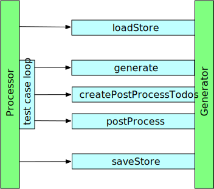

== Generator Overview
The generator is responsible to generate data. It is be called by the processor.
The processor will call all the generators in a loop until each generator has
returned a value. If the generator does direct manipulation of the testcaseData object
then it must nevertheless return a dummy value.

=== Generator life cycle

.Generator life cycle

The image shows the abstract life cycle of a generator. When the processor starts it gets all the generators
registered in the registry and calls the 'loadStore' function. Now every Generator is ready to be used.

NOTE: Not all the generators are using a store. But the function is called for each Generator.

Then the processor is starting the execution of the test cases. Each test case is independent from each other.
The processor loops over all the test cases. Then it will call for all the generators the 'generate' method until each
generator has returned a value. Some generators may need data, generated by another generator before. So if the
generator is not able to generate by the first call, the generator must return 'undefined'. Then it is called again.

If the generators 'generate' method has returned data, then the 'createPostProcessTodos' method is called.
The generator has now the possibility to return an array of todos. For each returned todo the processor will
call the 'postProcess' method. The idea behind the post processing is that sometimes it is not possible to create
data until all the generators have created the data. But it is not easy to find out for the processor if all
the other generators are executed. A postProcessTodo has also on order property. All the todos of all the generators
are sorted by these order number. Then all the todos are executed in this order.

After the processor has finished the execution of all test cases the 'saveStore' function is called.

=== InstanceId
The idea behind the instanceId is to create an id for each instance of generated data. So if the generator is
called twice with the same instance id it will return the same data. The instanceId is created by the processor
for each test case.

Example::
	There is a test case where the generator should create a password. But the password needs to be entered
	in two different fields. 'Password' and 'Password repeat'. This is common each time a user should reset the
	password. So in the equivalence class table the generator is called twice with the same instanceId. Then
	the generator should return the same data. This is explained in the tutorial in more detail.

=== Post processing
The post processing is an exceptional case for a generator. But is sometimes very use full. The post processing
works on the 'testcaseData' object directly. It will not return any data.

To make the processor calling the 'postProcess' function the generator must have returned one or more
of these 'postProcessTodo' objects before.

.post process todo object
[source,js]
----
{
  instanceIdSuffix: undefined   <1>
  order: 1000                   <2>
  config: {}                    <3>
  generatorName: 'MyGenerator', <4>
}
----
<1> (optional) The instanceId suffix. if not given the current instanceId is used
<2> (optional) The order number. Default is '1000'. All the todos are executed in the order of this number.
So it's up to the author of the generator to define the right order.
<3> (optional) The configuration for the function 'postProcess'.
<4> (mandatory) The name of the generator to be called. So it is possible that one generator creates
a postProcessTodo for another generator.

=== Generator constructor

.options when creating a generator
[cols="1,8",options="header"]
|===
|key|description
|logger | The logger this generator should use.
|serviceRegistry | The service registry. Each generator is added to the Service registry. And each
generator has access to this registry. So one generator could call another generator.
|unique| {true/false} (default=true) If set to a true value the data generator should return unique values
What unique means depends on the generator. If the generator create more than one field is up to the generator.
|maxUniqueTries | {number} (default=100) Defines how many tries the generator will do for getting a
unique value until it throws an error
|varDir| The directory used to store the generated data.
|useStore | {true/false} (default=false) Should the generator persists the data.
|===

.additional properties
[cols="1,8",options="header"]
|===
|key|description
|uniqueSet | A set to store the data which has to be unique
|instanceData | A map where all the generated data is mapped to the instanceId
|name | The name under which the generator is registered. Sometimes many instances of the same
generator class may be registered under different names.
|===
